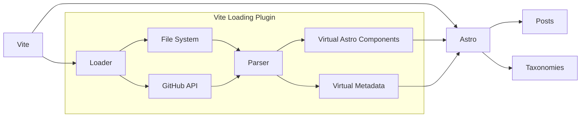
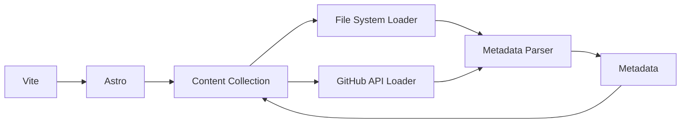
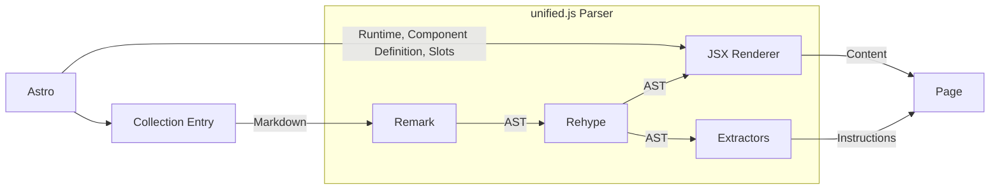

Another winter-rewrite of my blog, although too incremental for you to notice.

<!-- more -->

> [!INFO]
>
> At this time, the v4.9 hasn’t be stablized *yet*. You can try the [prerelease version](https://dev.blog-7mf.pages.dev) if you want.

It’s been 3 years since [v4](https://blog.yixuan-wang.site/post/blog-v4) of my blog, which was released in the [winter of 2023](https://github.com/Yixuan-Wang/blog/commit/c4589a6a89f51f8b895e9b067a343210229f1d3c). It’s a major overhaul, built upon a rather nascent framework, [Astro](https://astro.build). Surprisingly, this hearse[^1] survives, and I suspect it can last even longer should I not complete this rewrite.

[^1]: *Hearse*, a slang that roughly means “very unreliable computer program”.

## Why Rewrite?

Instead of trying new technology, this rewrite intends to **mitigate technical debt** introduced in v4. ChatGPT just came out before v4 was released, and since then, ~~there’s barely any news beyond obituaries coming out from the frontend world~~. Actually there’s a lot new stuff, but none of them seems relevant to a static boring blog. Meanwhile, Astro stayed, and evolved. It makes no sense to migrate to another framework and rewrite everything from scratch.

However, since Astro has evolved, there’s lots of new APIs and new possibilities. When last my blog rewrite concluded in February 2023, the Content Colletions API ([introduced in Astro 2 in January 2023](https://astro.build/blog/astro-2/)) just came out, and stayed uncustomizable until Content Layer API stablized in [Astro 5](https://astro.build/blog/astro-5/) in December 2024. With Content Layer API, I can finally integrate my hand-rolled *post load* logic into the officially supported pipeline. However, I didn’t realize the heavily customized *post render* logic can simply hook several internal Astro runtime APIs to do the heavy lifting, until I discovered [natemoo-re/astro-remote](https://github.com/natemoo-re/astro-remote).

The rewrite started and concluded so swiftly, all components were ready just 2 afternoons after the `v5` branch was created. It was more of a *refactor*, instead of a *rewrite*. Following LLM conglomerates’ nomenclature, let’s just name it incrementally, perhaps `v4.9`.

## Previous Design

The most significant change happens in post loading pipeline. Previously post loading happens within Vite bundling stage, as the following diagram shows.



But how are the Astro components generated? The Markdown parser has to be baked into the loading pipeline to parse the Markdown to HTML. Since Astro component syntax is a superset of HTML, with some slight cleaning these HTML become valid, importable Astro components. Meanwhile, all metadata extracted from frontmatter, like dates and taxonomies, and also the full post list, are serialized into a plain text metadata file. Then on the Astro part, it reads all the post components and metadata from these virtual files generated within Vite, and renders them.

This works, but in an ugly way:

- To render a single post, every post has to be fully parsed first.
- The post components and metadata are created and manipulated as strings, which is error-prone.
- During loading and parsing, Astro runtime is not available.
- Since each page is an independent component, there are lots of virtual files created in Vite.

The whole pipeline is actually quite similar to v3’s architecture, when `vite-ssg` was used and utilized Vite to do all the work. But since Astro provided content related APIs as it matured, the content loading part can be integrated deeper into Astro.

## Post Loading



There are no more Vite plugins in v4.9. Instead, I implemented my own [Astro Content Loaders](https://docs.astro.build/en/reference/content-loader-reference/), one for loading posts from file system using Node.js’s built-in `fs`, one for loading [posts from GitHub issues](https://allanchain.github.io/blog/post/vue-iblog/#why-use-github-issues) with built-in `fetch`. A lightweight frontmatter parser, [`gray-matter`](https://www.npmjs.com/package/gray-matter), extracts all metadata from the sources. Another content loader merges the metadata and raw Markdown contents from both sources into one Astro Content Collection. At this point, the metadata is already query-able via Astro’s Content Collections API, and no Markdown rendering has taken place. If I’m running a dev server to inspect one single post, this saves loads of compute.

## Post Rendering



The rendering now happens upon Astro’s request. When a post page is rendered, it queries the entry from the Content Collection, and handle the retrieved raw Markdown content over to the parser. The parser reuses most of the v4 `unified.js` pipeline, first parses the Markdown file into Markdown AST. This allows custom syntax to be added, for example Markdown attributes (a CommonMark [extension proposal](talk.commonmark.org/t/consistent-attribute-syntax/272), supported by [Pandoc](https://pandoc.org/MANUAL.html#extension-attributes), [Kramdown](https://kramdown.gettalong.org/quickref.html#block-attributes), [Goldmark](https://github.com/yuin/goldmark#attributes) and of course [Remark](https://github.com/remarkjs/remark-directive)). **No JSX in Markdown, thank you** 🫵.

Some more transformations are done on the Rehype stage, transforming Markdown AST to HTML AST. For example, here I transformed the following component elements into Astro component syntax:

```html
<component is="leipzig-glossing">
...
</component>

<LeipzigGlossing>
...
</LeipzigGlossing>
```

In this way, the parser doesn’t require any knowledge of which components exists at runtime, it just transforms standard Web Component syntax. At the same time it extracts useful information, like headings or $\LaTeX$ usages, which will be used as instructions during final page rendering. These are the same as v4.

The different part is the JSX rendering. Since the parser now lives within Astro lifecycle, the Astro runtime is accesible, and I use [hast-util-to-jsx-runtime](https://github.com/syntax-tree/hast-util-to-jsx-runtime)’s `toJsxRuntime` to transform the AST into an in-memory JSX object, and return an `AstroComponentFactory`.

```typescript
import { renderJSX, type AstroComponentFactory } from "astro/runtime/server/index.js";
import { jsx, jsxs, jsxDEV, Fragment } from "astro/jsx-runtime";

function render(input: string) {
  const { tree, customInstructions } = renderMarkdownIntoHtmlAst(input);
  const astroComponent: AstroComponentFactory = async (result, props, slots) => {
    // Load components and render slots
    const runtimeComponents = <load_runtime_components>();
    <render_slots>(tree);
  
    const { type, props: { children } } = toJsxRuntime(tree, {
      Fragment,
      jsx,
      jsxs,
      jsxDEV,
      components: runtimeComponents,
    });
    return renderJSX(result, jsx(type, { ...props, children }))
  }
  Object.assign(astroComponent, {
    isAstroComponentFactory: true,
  });
   
  return { Content: astroComponent, ...customInstructions }
}

```

`AstroComponentFactory`s are directly usable in Astro templates. The `render` function could be integrated into Astro’s Entry interface, but since it limits return type, and I want to return some custom instructions from the parser, I put it in a separate renderer module. The Astro template for the post page is as follows.

```astro
---
import { getCollection, getEntry } from "astro:content";
import { render } from "<my_renderer>";

const { slug } = Astro.params as {
  slug: string;
};

const post = await getEntry("posts", slug)!;
const { Content, <instructions_1>, <instructions_2> } = await render(post.body!);
---
<Content>
</Content>
```

Additionally, some notes on the runtime components and slots. I put all runtime-available components in a `~/components/runtime` folder, and use Vite’s [glob import](https://vite.dev/guide/features#glob-import) to load them all together.

```typescript
import.meta.glob("~/components/runtime/*.astro", {
  eager: false,
  import: "default",
}
```

Map the keys to `path.basename(key, ".astro")`, and values to `await value()`, you are good to pass them into the `toJsxRuntime` function.

The slots are a little bit harder. Since each post is no longer an Astro component, how could it render any slots anymore? Introducing another ugly hack: I just eagerly render all the slot contents, and simply do an extra AST pass to transform all slots into `set:html` instructions.

```typescript
import { renderSlotToString } from "astro/runtime/server/render/slot.js";
import { chunkToString } from "astro/runtime/server/render/common.js";
import { visit } from "unist-util-visit";

const slotName = (str: string) => str.trim().replace(/[-_]([a-z])/g, (_, w) => w.toUpperCase());
const transformedSlots: Record<string, any> = {};
for (const [name, slot] of Object.entries(slots)) {
  transformedSlots[slotName(name)] = chunkToString(
    result,
    await renderSlotToString(result, slot as any)
  )
}

visit(componentTree, (node) => {
  if (node.type !== "element") return;
  if (node.tagName === "slot") {
    const name = slotName(node.properties?.name?.toString() ?? "default");
    if (transformedSlots[name]) {
      node.tagName = "Fragment";
      delete node.properties?.name;
      node.properties["set:html"] = transformedSlots[name];
    }
  }
});
```

## Post Querying

For post querying, Content Collection’s native API doesn’t have any advanced query functions, and dumping every metadata into Astro DB seems too heavy. Remember Polars? It has [an official Node.js binding](https://github.com/pola-rs/nodejs-polars). I just dump every metadata into a Polars dataframe and cache it as a module-level object.

```typescript
const posts = await getCollection("posts");
const dataset = pl.DataFrame(
    posts.map(post => ({
      id: post.id,
      ...post.data,
  })),
  { 
    orient: 'row',
    schemaOverrides: {
      series: pl.Struct({
        name: pl.Utf8,
        index: pl.Int32,
      }),
    }
  }
);
```

Sadly Polars has limited support on complex data structures, namely, you cannot create owned `Structs`, which prohibits `.value_counts()`. Beyond this, it’s very convenient to use Polars to sort, group and count everything. The taxonomy pages (archive, categories, tags and series) are now using Polars to generate.

## What’s Dropped?

Not everything was kept intact after this rewrite. There was a taxonomy page, which myself can’t remember its existence, being removed for good. And **UnoCSS support for individual blog posts is also dropped**. Since each post is no longer an independent Astro component and no longer go through the Vite pipeline, UnoCSS won’t scan the posts and inject the style definitions any more. **I would argue that is removed for good**. *The blog style needs to be consitent*, and the ability to change styles too easily is not beneficial to this goal. When custom styles are absolutely needed, for example to render NYC Subway service bullets, plain inline CSS styles works *just fine*, and is supported out of the box by everyone, such as Typora and VS Code’s markdown preview.

## Nice New Stuff

### Comments

I migrated comments from Giscus to [Waline](https://waline.js.org/). I no longer require my readers to have a GitHub account to interact with me. Even though lots of my readers *do have a GitHub account*, they might not want to grant it access to my spurious infrastructure. That’s okay. With the new comment system with a dedicated backend, all comments are welcomed.

### Mermaid

Now Mermaid graphs have adaptive colors and dynamic dark mode support. Mermaid is loaded from CDN, as it cannot be reliably rendered within Node.js.

### Media Links

Another long missing feature is a media links card. The media streaming platforms are walled and fragmented. Similar to color palettes, I don’t mind what platforms my readers prefer. Everyone should have access to the media I shared at a place they feel most comfortable.

<component is="medialinks">
title: 米店
artist: 张玮玮、郭龙
album: 白银饭店
albumArt: https://is1-ssl.mzstatic.com/image/thumb/Music116/v4/03/7d/e8/037de8b9-444d-1dc9-ec42-1107eb0f41ed/4894944303565.jpg/632x632bb.webp
links:
  apple: https://music.apple.com/cn/album/%E7%B1%B3%E5%BA%97/1707829774?i=1707829783
  qq: https://i.y.qq.com/v8/playsong.html?songid=106007924&songtype=0#webchat_redirect
  netease: https://music.163.com/song?id=26494698
</component>

