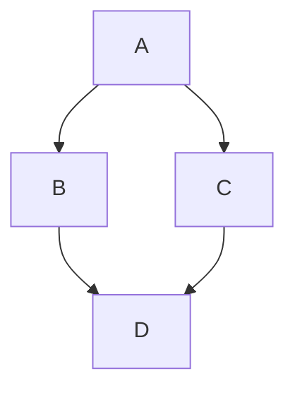

页面高级内容渲染效果的测试。

<!-- more -->

> [!UPDATE]
>
> - 2024-08-31：加入了 Mermaid 图的支持！
> - 2024-02-18：更新了 GitHub 风格的 Callout！

## 扩展 Markdown 语法及样式系统

:::::::details[太长不想看]{open}

### 详情

```markdown
:::::details[点击以展开] 
这里有些隐藏的内容。

可以有多段。

:::details[<strong>再点击！</strong>]
还可以嵌套。
:::
:::::
```

:::::details[点击以展开] 
这里有些隐藏的内容。

可以有多段。

:::details[<strong>再点击！</strong>]
还可以嵌套。
:::
:::::

### 卡片、空块和行内元素

```markdown
:::div{.card .text-back .bg-front}
这是一张卡片

圆角的。默认反色。有一些内容。
:::

:::div{.some-class}
而这是一个无聊的空 `<div>`。
:::
```

:::div{.card .text-back .bg-front}
这是一张卡片

圆角的。默认反色。有一些内容。
:::

:::div{.some-class}
而这是一个无聊的空 `<div>`。
:::

```markdown
:span[平平无奇。]{.some-class}
```

:span[平平无奇。]{.some-class}


### UnoCSS

```markdown
This is :span[red]{.text-red-500}, :span[light]{.font-light}, :span[Small-caps]{.small-caps}.
While this is :span[red and light and small-caps]{.text-red-500 .font-light .small-caps}.

This is :span[**bold and red**]{.text-red-500}. While this is :span[`monospace and red`]{.text-red-500}. 

This one is :a[a link forced to be red]{href="#详情" class="!text-red-500"}.

Custom values are :span[**fine**]{.px-1 class="bg-[#114514]" .text-white}.
```

This is :span[red]{.text-red-500}, :span[light]{.font-light}, :span[Small-caps]{.small-caps}.
While this is :span[red and light and small-caps]{.text-red-500 .font-light .small-caps}.

This is :span[**bold and red**]{.text-red-500}. While this is :span[`monospace and red`]{.text-red-500}. 

This one is :a[a link forced to be red]{href="#详情" class="!text-red-500"}.

Custom values are :span[**fine**]{.px-1 class="bg-[#114514]" .text-white}.

```markdown
:::div{ .card .bg-one-back .text-front }
:h4[块也可以]{ class="!mb-0" }

有一些内容。
:::
```

:::div{ .card .bg-one-back .text-front }
:h4[块也可以]{ class="!mb-0" }

有一些内容。
:::

:::::::

## Ruby

```markdown
[夢](-ゆめ)に[僕](-ぼく)らで[帆](-ほ)を[張](-は)って　
[来](-きた)るべき[日](-ひ)のために[夜](-よる)を[越](-こ)え
```

[夢](-ゆめ)に[僕](-ぼく)らで[帆](-ほ)を[張](-は)って　
[来](-きた)るべき[日](-ひ)のために[夜](-よる)を[越](-こ)え


## 莱比锡标注法

```html
<component is="leipzig-glossing">
  <p>Russian</p>
  <p align lang="ru">My s Marko poexa-l-i avtobus-om v Peredelkino. </p>
  <p align gloss>1PL COM Marko go-PST-PL bus-INS ALL Peredelkino</p>
  <p>'Marko and I went to Perdelkino by bus.'</p>
</component>
```

<component is="leipzig-glossing">
  <p>Russian</p>
  <p align lang="ru">My s Marko poexa-l-i avtobus-om v Peredelkino. </p>
  <p align gloss>1PL COM Marko go-PST-PL bus-INS ALL Peredelkino</p>
  <p>'Marko and I went to Perdelkino by bus.'</p>
</component>

## Callout

```markdown
> [!WARNING]
> The following syntax is exclusive to Python 2.
> ```python
> print "Hello, world!"
> ```
```

> [!WARNING]
> The following syntax is exclusive to Python 2.
> ```python
> print "Hello, world!"
> ```

支持的 Callout 类型：

- `INFO` / `NOTE`
- `TIP`
- `WARNING`
- `CAUTION`
- `IMPORTANT`
- `TLDR`
- `TBC`
- `UPDATE`

:::::details[所有类型] 

> [!INFO]
> This is an information message.

> [!TIP]
> This is a tip message.

> [!WARNING]
> This is a warning message.

> [!CAUTION]
> This is a caution message.

> [!IMPORTANT]
> This is an important message.

> [!TLDR]
> This is a TLDR message.

> [!TBC]
> This is a comming-soon message.

> [!UPDATE]
> This is an update message.
:::::


## Mermaid 图

````markdown

````


Mermaid 依赖在运行时从 CDN 动态加载。目前试用固定颜色。

## 地图

```html
<component
  is="geo"
  lat="39.9935"
  long="116.303873"
  tile="osm"
/>

<!--
tile="osm"
tile="carto"
tile="tianditu"
-->
```

<component is="geo" lat="39.9935" long="116.303873" tile="osm"></component>

<component is="geo" lat="39.9935" long="116.303873" tile="carto"></component>

<component is="geo" lat="39.9935" long="116.303873" tile="tianditu"></component> 


基于 Leaflet 实现的地图。

## 多媒体链接

```markdown
<component is="medialinks">
  title: "Never Gonna Give You Up"
  artist: "Rick Astley"
  album: "Whenever You Need Somebody"
  albumArt: ...
  links:
    spotify: ...
    apple: ...
    youtube-music: ...
    netease: ...
    qq: ...
    youtube: ...
    bilibili: ...
</component>
```

<component is="medialinks">
  title: "Never Gonna Give You Up"
  artist: "Rick Astley"
  album: "Whenever You Need Somebody"
  albumArt: "https://is1-ssl.mzstatic.com/image/thumb/Music124/v4/ce/6d/5b/ce6d5b48-8c36-b990-3b9c-81862fadb459/0859381157694.jpg/632x632bb.webp"
  links:
    spotify: "https://open.spotify.com/track/4uLU6hMCjMI75M1A2tKUQC"
    apple: "https://music.apple.com/us/album/never-gonna-give-you-up/1559885420?i=1559885421"
    youtube-music: "https://music.youtube.com/watch?v=lYBUbBu4W08"
    netease: "https://music.163.com/#/song?id=5221167"
    qq: "https://c6.y.qq.com/base/fcgi-bin/u?__=jkKN3fFW5dg2"
    youtube: "https://www.youtube.com/watch?v=dQw4w9WgXcQ"
    bilibili: "https://www.bilibili.com/video/BV1Zt411x7h7"
</component>

<component is="medialinks">
  title: "愛にできることはまだあるかい"
  artist: "RADWIMPS"
  album: "天気の子"
  type: video
  links:
    youtube: "https://www.youtube.com/watch?v=EQ94zflNqn4"
    bilibili: "https://www.bilibili.com/video/BV1fa411n7hZ"
</component>

支持多种流媒体平台链接的卡片组件，使用 YAML 作为数据格式。可以使用 `type: video` 来指定显示为视频。